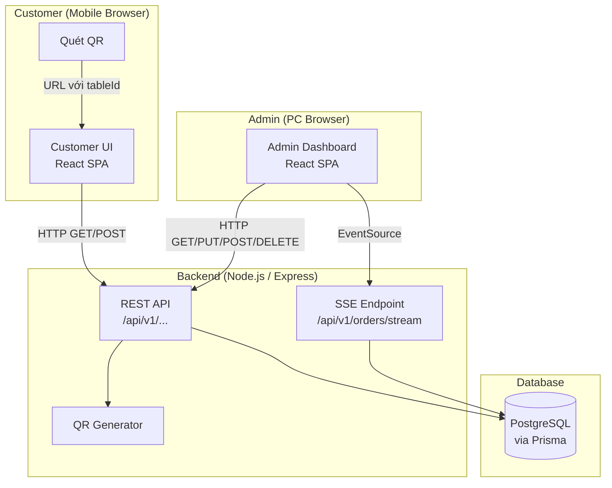

# Design Document: QR Order System

## Overview

QR Order System là ứng dụng web cho phép khách hàng quét mã QR tại bàn để xem thực đơn, quản lý giỏ hàng và đặt món. Nhân viên/admin theo dõi đơn hàng và quản lý thực đơn, bàn ăn qua Admin Dashboard với cập nhật real-time (≤5 giây).

Hệ thống MVP gồm 7 màn hình chính, không tích hợp thanh toán trực tuyến.

### Công nghệ được chọn

| Layer | Công nghệ | Lý do |
|---|---|---|
| Frontend (Customer + Admin) | React + TypeScript (Vite) | SPA nhanh, component tái sử dụng cho cả 2 giao diện |
| Backend API | Node.js + Express + TypeScript | REST API đơn giản, dễ mở rộng |
| Database | PostgreSQL | Quan hệ rõ ràng, hỗ trợ JSONB nếu cần |
| Real-time | Server-Sent Events (SSE) | Đơn giản hơn WebSocket cho luồng 1 chiều (server → admin) |
| QR Generation | `qrcode` (npm) | Thư viện mạnh, xuất PNG phía server |
| ORM | Prisma | Type-safe, migration tốt |
| State Management | Zustand | Nhẹ, phù hợp cho Cart và session |

---

## Architecture

Hệ thống theo kiến trúc **Client–Server** với một backend API duy nhất phục vụ cả Customer UI và Admin Dashboard.



### Luồng dữ liệu chính

1. **Khách quét QR** → URL dạng `https://app/menu?tableId=<uuid>` → Customer UI load thực đơn.
2. **Khách đặt món** → POST `/api/v1/orders` → Order lưu DB → SSE broadcast → Admin Dashboard cập nhật trong ≤5s.
3. **Admin cập nhật trạng thái** → PUT `/api/v1/orders/:id/status` → lưu DB.

---

## Components and Interfaces

### Frontend Components

#### Customer UI (7 màn hình MVP)

| Màn hình | Route | Mô tả |
|---|---|---|
| Landing/Error | `/menu?tableId=xxx` | Xác thực bàn, redirect lỗi nếu không hợp lệ |
| Menu | `/menu` | Danh mục + danh sách món |
| Cart | `/cart` | Giỏ hàng, tổng tiền, nút đặt món |
| Order Confirmation | `/order-success` | Xác nhận đơn thành công |

#### Admin Dashboard

| Màn hình | Route | Mô tả |
|---|---|---|
| Orders | `/admin/orders` | Danh sách đơn real-time, lọc theo status |
| Menu Management | `/admin/menu` | CRUD Category + MenuItem |
| Table Management | `/admin/tables` | CRUD bàn, xem/tải QR |

### Backend API Endpoints

#### Tables

```
GET    /api/v1/tables               → Danh sách tất cả bàn
GET    /api/v1/tables/:id           → Chi tiết một bàn (dùng để xác thực QR)
POST   /api/v1/tables               → Tạo bàn mới
PUT    /api/v1/tables/:id           → Cập nhật tên / trạng thái bàn
GET    /api/v1/tables/:id/qr        → Tải file PNG mã QR của bàn
```

#### Menu

```
GET    /api/v1/categories           → Danh sách Category đang hoạt động (có MenuItem)
POST   /api/v1/categories           → Tạo Category mới
PUT    /api/v1/categories/:id       → Cập nhật Category
DELETE /api/v1/categories/:id       → Xóa Category (kiểm tra MenuItem)
PUT    /api/v1/categories/reorder   → Cập nhật thứ tự Category

GET    /api/v1/menu-items           → Danh sách MenuItem (lọc theo categoryId)
POST   /api/v1/menu-items           → Tạo MenuItem mới
PUT    /api/v1/menu-items/:id       → Cập nhật MenuItem
DELETE /api/v1/menu-items/:id       → Xóa MenuItem
PUT    /api/v1/menu-items/reorder   → Cập nhật thứ tự MenuItem
```

#### Orders

```
POST   /api/v1/orders               → Tạo Order mới
GET    /api/v1/orders               → Danh sách Order (lọc theo status)
PUT    /api/v1/orders/:id/status    → Cập nhật Order_Status
GET    /api/v1/orders/stream        → SSE stream cho Admin Dashboard
```

---

## Data Models

### Prisma Schema

```prisma
model Table {
  id        String   @id @default(uuid())
  name      String
  isActive  Boolean  @default(true)
  createdAt DateTime @default(now())
  updatedAt DateTime @updatedAt
  orders    Order[]
}

model Category {
  id          String     @id @default(uuid())
  name        String
  displayOrder Int       @default(0)
  isActive    Boolean    @default(true)
  createdAt   DateTime   @default(now())
  updatedAt   DateTime   @updatedAt
  menuItems   MenuItem[]
}

model MenuItem {
  id           String      @id @default(uuid())
  name         String
  price        Decimal     @db.Decimal(10, 2)
  imageUrl     String?
  isAvailable  Boolean     @default(true)
  displayOrder Int         @default(0)
  categoryId   String
  category     Category    @relation(fields: [categoryId], references: [id])
  createdAt    DateTime    @default(now())
  updatedAt    DateTime    @updatedAt
  orderItems   OrderItem[]
}

model Order {
  id          String      @id @default(uuid())
  tableId     String
  table       Table       @relation(fields: [tableId], references: [id])
  status      OrderStatus @default(pending)
  orderedAt   DateTime    @default(now())
  updatedAt   DateTime    @updatedAt
  orderItems  OrderItem[]
}

model OrderItem {
  id           String   @id @default(uuid())
  orderId      String
  order        Order    @relation(fields: [orderId], references: [id])
  menuItemId   String
  menuItem     MenuItem @relation(fields: [menuItemId], references: [id])
  quantity     Int
  priceAtOrder Decimal  @db.Decimal(10, 2)
}

enum OrderStatus {
  pending
  confirmed
  served
  completed
}
```

### Cart (Client-side State - Zustand)

```typescript
interface CartItem {
  menuItemId: string;
  name: string;
  price: number;
  quantity: number;
  imageUrl?: string;
}

interface CartState {
  tableId: string | null;
  items: CartItem[];
  addItem: (item: Omit<CartItem, 'quantity'>) => void;
  updateQuantity: (menuItemId: string, quantity: number) => void;
  removeItem: (menuItemId: string) => void;
  clearCart: () => void;
  totalQuantity: () => number;
  totalPrice: () => number;
}
```

> `priceAtOrder` được lưu trong `OrderItem` để bảo toàn giá tại thời điểm đặt hàng, tránh ảnh hưởng khi admin sau đó thay đổi giá `MenuItem`.

---

## Correctness Properties

*A property is a characteristic or behavior that should hold true across all valid executions of a system — essentially, a formal statement about what the system should do. Properties serve as the bridge between human-readable specifications and machine-verifiable correctness guarantees.*

### Property 1: Xác thực bàn — kết quả nhất quán với trạng thái bàn

*For any* tableId, kết quả xác thực SHALL nhất quán với trạng thái bàn trong DB: nếu tableId tồn tại và `isActive = true` → trả về thông tin bàn; nếu tableId không tồn tại → lỗi TABLE_NOT_FOUND; nếu `isActive = false` → lỗi TABLE_INACTIVE.

**Validates: Requirements 1.1, 1.3, 1.4**

---

### Property 2: Category filter đúng theo trạng thái và thứ tự

*For any* tập Categories với `isActive` và `displayOrder` bất kỳ, API GET categories SHALL chỉ trả về các Category có `isActive = true`, sắp xếp tăng dần theo `displayOrder`.

**Validates: Requirements 2.1**

---

### Property 3: MenuItem filter đúng theo categoryId

*For any* categoryId hợp lệ, mọi MenuItem trong response GET menu-items SHALL có `categoryId` khớp đúng với categoryId được truy vấn.

**Validates: Requirements 2.2**

---

### Property 4: MenuItem hết hàng không thể thêm vào Cart

*For any* MenuItem có `isAvailable = false`, Cart.addItem SHALL từ chối thêm item đó — bất kể trạng thái hiển thị visual có thành công hay không.

**Validates: Requirements 2.3**

---

### Property 5: Cart totals invariant sau mọi thao tác

*For any* danh sách CartItem với quantity ≥ 1, `totalQuantity()` SHALL bằng `sum(item.quantity)` và `totalPrice()` SHALL bằng `sum(item.price × item.quantity)` — bất biến này đúng ngay sau mỗi thao tác thêm, sửa số lượng hoặc xóa item.

**Validates: Requirements 3.1, 3.3**

---

### Property 6: Xóa tất cả CartItem dẫn đến Cart rỗng

*For any* Cart chứa bất kỳ số lượng item nào (≥1), sau khi giảm quantity tất cả item về 0, `Cart.items` SHALL là mảng rỗng và cả `totalQuantity()` lẫn `totalPrice()` SHALL bằng 0.

**Validates: Requirements 3.2, 3.5**

---

### Property 7: Order tạo ra phản ánh đúng Cart và có timestamp hợp lệ

*For any* Cart không rỗng gắn với tableId hợp lệ đang hoạt động, Order được tạo bởi Order_Service SHALL có: đúng `tableId`, đúng danh sách OrderItem (menuItemId + quantity + priceAtOrder), `status = pending`, và `orderedAt` không null trong khoảng thời gian hợp lệ (≥ thời điểm gửi request).

**Validates: Requirements 4.1, 4.4**

---

### Property 8: Trạng thái Cart sau khi đặt hàng phụ thuộc vào kết quả Order

*For any* Cart không rỗng, nếu Order_Service trả về thành công thì Cart SHALL trở thành rỗng; nếu Order_Service trả về lỗi thì Cart SHALL giữ nguyên nội dung không thay đổi.

**Validates: Requirements 4.2, 4.3**

---

### Property 9: Orders list filter đúng theo status và sort đúng theo thời gian

*For any* tập Orders với statuses và timestamps bất kỳ, API GET orders với filter status SHALL chỉ trả về Orders có status khớp, sắp xếp tăng dần theo `orderedAt` (cũ → mới).

**Validates: Requirements 5.1, 5.5**

---

### Property 10: Order response chứa đầy đủ thông tin bắt buộc

*For any* Order trong hệ thống, response của GET orders SHALL bao gồm: thông tin Table (tên bàn), danh sách OrderItem (tên món, số lượng), và `orderedAt`.

**Validates: Requirements 5.3**

---

### Property 11: Cập nhật trạng thái Order được lưu đúng

*For any* valid status transition (pending→confirmed, confirmed→served, served→completed), sau khi PUT `/orders/:id/status`, GET Order đó SHALL trả về status mới và `updatedAt` lớn hơn `updatedAt` trước đó.

**Validates: Requirements 5.4**

---

### Property 12: MenuItem update round-trip — thay đổi phản ánh ngay trên API

*For any* MenuItem được admin cập nhật (name, price, isAvailable, hoặc bất kỳ field nào), các GET request tiếp theo tới Menu_Service SHALL trả về chính xác dữ liệu đã cập nhật — đặc biệt, MenuItem với `isAvailable = false` SHALL không thể thêm vào Cart.

**Validates: Requirements 6.3, 6.4**

---

### Property 13: Xóa Category có MenuItem bị chặn; Category rỗng xóa được

*For any* Category, nếu số lượng MenuItem thuộc category đó > 0 thì DELETE SHALL bị từ chối (409); nếu số lượng MenuItem = 0 thì DELETE SHALL thành công.

**Validates: Requirements 6.5**

---

### Property 14: Reorder cập nhật đúng displayOrder

*For any* danh sách Category/MenuItem với thứ tự mới bất kỳ, sau khi PUT reorder, GET danh sách SHALL trả về theo đúng `displayOrder` mới được gán.

**Validates: Requirements 6.6**

---

### Property 15: QR URL chứa đúng tableId và bất biến khi đổi tên bàn

*For any* Table, URL được mã hóa trong QR SHALL chứa đúng `tableId` (UUID) của Table đó; sau khi admin cập nhật tên Table bất kỳ số lần, `tableId` trong QR URL SHALL không thay đổi.

**Validates: Requirements 7.2, 7.4**

---

### Property 16: Table bị vô hiệu hóa — mọi request đặt món bị từ chối

*For any* Table với `isActive = false`, mọi POST `/orders` hoặc GET `/tables/:id` từ Customer UI SHALL bị từ chối với lỗi TABLE_INACTIVE, bất kể khách đang ở trong phiên đặt món hay không.

**Validates: Requirements 7.5**

---

## Error Handling

### HTTP Error Codes

| Tình huống | HTTP Status | Response Body |
|---|---|---|
| tableId không tồn tại | 404 | `{ "error": "TABLE_NOT_FOUND" }` |
| Table không hoạt động | 403 | `{ "error": "TABLE_INACTIVE" }` |
| MenuItem hết hàng khi đặt | 409 | `{ "error": "ITEM_UNAVAILABLE", "itemId": "..." }` |
| Cart rỗng khi đặt | 400 | `{ "error": "EMPTY_CART" }` |
| Xóa Category có MenuItem | 409 | `{ "error": "CATEGORY_HAS_ITEMS" }` |
| Server lỗi nội bộ | 500 | `{ "error": "INTERNAL_ERROR" }` |

### Frontend Error Strategy

- **Menu không tải được (>10s)**: Hiển thị thông báo lỗi + nút "Thử lại" (retry).
- **Đặt món thất bại**: Toast error, giữ nguyên Cart.
- **SSE mất kết nối**: Admin Dashboard tự kết nối lại với exponential backoff (1s → 2s → 4s → max 30s); hiển thị badge "Đang kết nối lại..." trong UI.
- **Table không hợp lệ / không hoạt động**: Hiển thị trang lỗi full-screen, không render thực đơn.

### Cart Consistency

- Trước khi gửi Order, frontend kiểm tra lại trạng thái `isAvailable` của từng MenuItem trong Cart. Nếu có món hết hàng, hiển thị cảnh báo và xóa món đó khỏi Cart trước khi gửi.
- `priceAtOrder` snapshot được lấy từ giá hiện tại tại thời điểm đặt, không đồng bộ ngược về Cart.

---

## Testing Strategy

### Dual Testing Approach

Hệ thống sử dụng kết hợp **unit tests** cho các ví dụ cụ thể và **property-based tests** cho các tính chất tổng quát.

### Property-Based Testing

**Thư viện**: `fast-check` (TypeScript/JavaScript) — hỗ trợ tốt cho cả frontend (Vitest) và backend (Jest/Vitest).

**Cấu hình**: Mỗi property test chạy tối thiểu **100 iterations**.

**Tag format**: `// Feature: qr-order-system, Property {N}: {property_text}`

| Property | Mô tả test | Generators |
|---|---|---|
| P1 | Xác thực tableId — valid/invalid/inactive | `fc.uuid()`, random strings, `fc.boolean()` cho isActive |
| P2 | Category filter isActive + sort displayOrder | `fc.array(categoryArb)` với random displayOrder |
| P3 | MenuItem filter đúng categoryId | `fc.array(menuItemArb)` với categoryId phân tán |
| P4 | Unavailable MenuItem bị Cart reject | `fc.boolean()` cho isAvailable |
| P5 | Cart totals invariant | `fc.array(cartItemArb, { minLength: 1 })` |
| P6 | Cart rỗng khi xóa hết items | `fc.array(cartItemArb, { minLength: 1 })` |
| P7 | Order creation đúng Cart + timestamp | `fc.array(orderItemArb, { minLength: 1 })` |
| P8 | Cart state sau success/failure Order | `fc.boolean()` cho outcome + `fc.array(cartItemArb)` |
| P9 | Orders filter + sort | `fc.array(orderArb)` với random statuses/timestamps |
| P10 | Order response completeness | `fc.array(orderArb, { minLength: 1 })` |
| P11 | Status transition lưu đúng + updatedAt | `fc.constantFrom(...validTransitions)` |
| P12 | MenuItem update round-trip | `fc.record(menuItemUpdateArb)` |
| P13 | Category delete guard | `fc.nat()` cho menuItem count |
| P14 | Reorder cập nhật displayOrder | `fc.array(fc.nat())` cho new orders |
| P15 | QR URL chứa tableId + bất biến khi rename | `fc.uuid()` + `fc.string()` cho name |
| P16 | Inactive Table reject all requests | `fc.boolean()` cho isActive |

### Unit Tests (Example-Based)

- **Cart logic**: Thêm cùng một MenuItem 2 lần → quantity tăng 2; giảm về 0 → tự xóa.
- **Order creation**: POST với Cart hợp lệ → 201 + Order object; POST với Cart rỗng → 400.
- **Category delete guard**: DELETE category có MenuItem → 409; DELETE category rỗng → 200.
- **Table validation**: GET `/tables/:id` với UUID không tồn tại → 404; Table inactive → 403.
- **Menu load**: Mock API delay 10s → error UI + retry button xuất hiện.
- **Session persistence**: Navigate giữa categories → Cart giữ nguyên.
- **QR download**: GET `/tables/:id/qr` → Content-Type: image/png.
- **Multiple orders same session**: Sau khi đặt thành công, Cart cho phép thêm món mới.

### Integration Tests

- End-to-end: Quét QR → load menu → thêm món → đặt → Admin nhận SSE trong ≤5s.
- SSE reconnect: Ngắt kết nối giả lập → verify client tự reconnect.
- MenuItem availability sync: Admin đánh dấu hết hàng → Customer UI GET menu phản ánh ngay.

### Test Structure

```
src/
  __tests__/
    unit/
      cart.store.test.ts          # Property + unit tests cho Cart
      order.service.test.ts       # Property + unit tests cho Order_Service
      menu.service.test.ts        # Property + unit tests cho Menu_Service
      qr.generator.test.ts        # Property + unit tests cho QR URL invariant
    integration/
      order-flow.test.ts          # End-to-end flow
      sse.test.ts                 # SSE latency và reconnect
```
